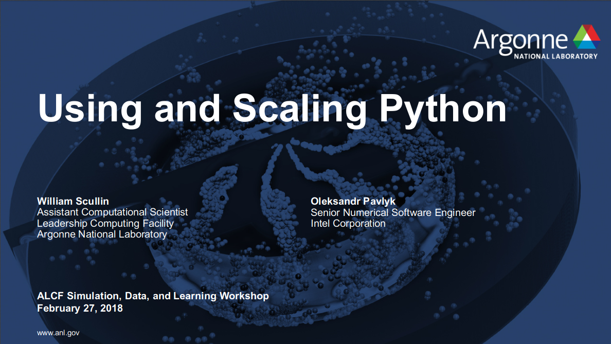

[Full list of Python Materials]({{site.baseurl}}/python-for-hpc/)

## In the Spotlight ...

**Featured Webinar:**

Jupyter and HPC: Current State and Future Roadmap

<iframe width="280" height="157" src="https://www.youtube.com/embed/aKah_O5OZdE" frameborder="0" allow="autoplay; encrypted-media" allowfullscreen></iframe> 

[Webinar Page](https://www.exascaleproject.org/event/jupyter/)

---

**Featured Presentation:**

Using and Scaling Python
ALCF Simulation, Data, and Learning Workshop 2018. William Scullin (ALCF) and Oleksandr Pavlyk (Intel)

 
<!--<iframe width="280" height="157" src="https://www.youtube.com/embed/14rbhkrRxUs" frameborder="0" allow="autoplay; encrypted-media" allowfullscreen></iframe>-->

---

<!--<iframe width="560" height="315" src="https://www.youtube.com/embed/14rbhkrRxUs" frameborder="0" allow="autoplay; encrypted-media" allowfullscreen></iframe>

<iframe width="560" height="315" src="https://www.youtube.com/embed/aKah_O5OZdE" frameborder="0" allow="autoplay; encrypted-media" allowfullscreen></iframe> -->
